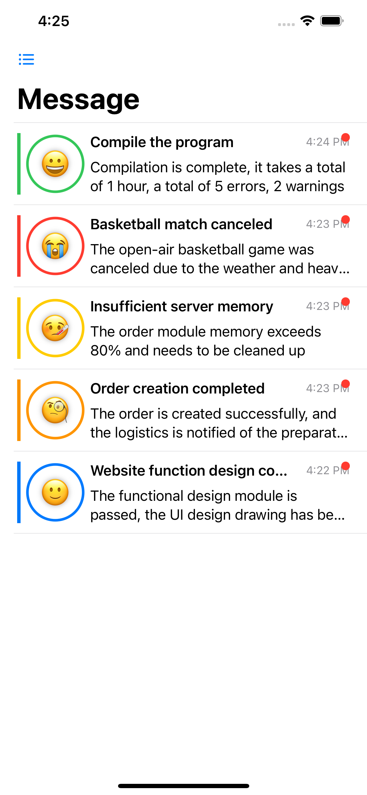
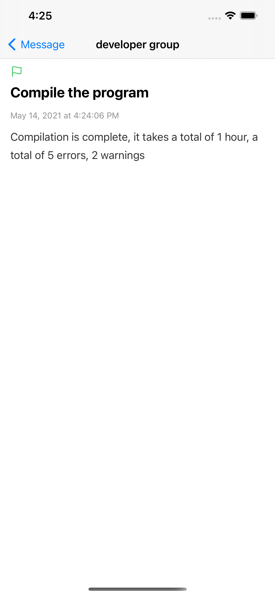

# Customize Notifications Golang SDK

[](https://github.com/renjunok/customize-notifications-golang-sdk/actions/workflows/ci.yml)

## [中文](https://github.com/renjunok/customize-notifications-golang-sdk/blob/main/README-CN.md)

## SDK
[Golang](https://github.com/renjunok/customize-notifications-golang-sdk)
[Python](https://github.com/renjunok/customize-notifications-python-sdk)

## Development Document
**If you use other development languages, please refer to the development documentation**

[Development Document](api-doc-en.md)

## Description
"My Notice" is an application that allows users to send custom messages to themselves. Developers, operation and maintenance personnel or startup teams can send custom push messages to mobile phones.




## Scenes to be used
After you integrate and call the interface in the code, a customized message will be pushed to this application. Common usage scenarios are such as:
- An error occurred during program operation.
- Customer order processing.
- Server CPU usage is too high.
- Concerned content updates.

## Message type
1.  `General message(primary)`
0.  `Success message(success)`
0.  `Information messages(info)`
0.  `Warning message(warning)`
0.  `Fail message(fail)`

## Application
[iOS Store]("https://apps.apple.com/us/app/my-notice-customize-notice/id1566837067")

## Run environment
> - Go 1.5+

## Install
> - `go get github.com/renjunok/customize-notifications-golang-sdk`
> - `import "github.com/renjunok/customize-notifications-golang-sdk/message"`

## Use method
> - iOS users install application in app store
> - After opening the app, click the menu in the upper left corner to get the configuration information, ID and Secret
> - Execute the following code in the notification message you need to customize
```golang
	m, err := message.NewMessage("test title", "test content", 0, "developer group")
	if err != nil {
		// handler err
		return
	}
	err = m.Send("your id", "your secret")
	if err != nil {
		// handler err
		return
	}
```

## Precautions
- title, content, msgType fields are required, group field optional
- The maximum number of title characters is 100, the maximum content is 4000, and the maximum group is 20
- The msgType types are 0 primary, 1 success, 2 info, 3 warning, 4 fail
- The api call rate is at most three times within 1 minute, and requests beyond the call will not be processed


